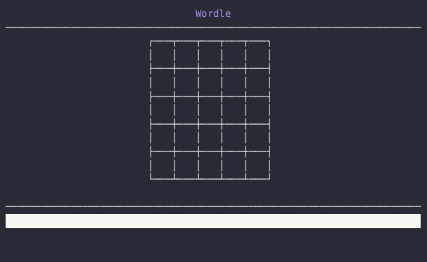

# Wordle

📘 Wordle game in the terminal using C++ & FTXUI

<div align="center">



<!--prettier-ignore-->
**[Overview](https://github.com/jcbhmr/wordle#readme)**
| [Dev wiki](https://github.com/jcbhmr/wordle/tree/main/wiki#readme)
| [packages/fetch](https://github.com/jcbhmr/wordle/tree/main/packages/fetch#readme)
| [packages/html-location](https://github.com/jcbhmr/wordle/tree/main/packages/html-location#readme)

</div>

## Installation

[](https://gcc.gnu.org/)
[](https://clang.llvm.org/)
[](http://www.cplusplus.org/)
[](https://conan.io/)

⚠️ This app requires you to compile it yourself [🍰](https://twitter.com/bbotezatu/status/768756952528723969) \
✅ This app successfully compiles using xmake on [the devcontainer](https://github.com/jcbhmr/wordle/blob/main/.devcontainer/devcontainer.json)

1. Clone this repository
   ```sh
   git clone https://github.com/jcbhmr/wordle.git
   ```
2. Ensure you have [`xmake`](https://xmake.io/#/) and [`conan`](https://docs.conan.io/en/latest/installation.html) installed on your system
3. Run the following commands:
   ```sh
   tools/gen-repo-index.sh
   xmake
   ```
5. 🎉 You can now run `xmake r` in your shell and play Wordle!

## Usage


```
Usage: /workspaces/wordle/build/linux/x86_64/release/wordle [-h] [--dict VAR] [--answer] date

Positional arguments:
  date          Which date to use as the answer word [default: "2022-12-11T22:49:21+0000"]

Optional arguments:
  -h, --help    shows help message and exits
  -v, --version prints version information and exits
  -d, --dict    A JSON dictionary file to use (https://github.com/jcbhmr/wordle/blob/main/assets/dict/official.json) [default: "/home/codespace/.config/wordle/dict.json"]
  -a, --answer  Show the answer word
```
