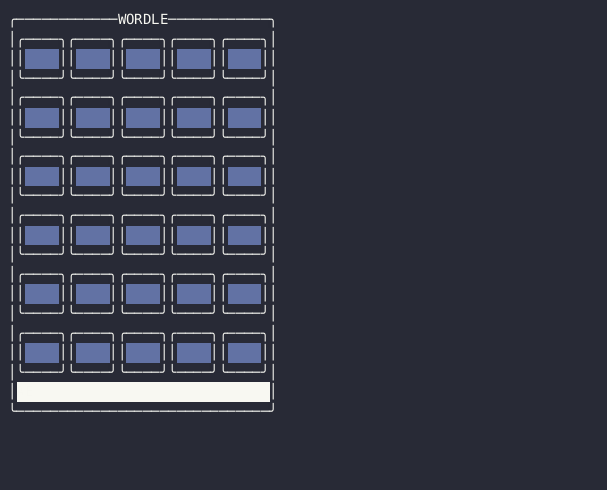

# Wordle

📘 Wordle game in the terminal using C++ & FTXUI

<div align="center">



<!--prettier-ignore-->
**[Overview](https://github.com/jcbhmr/wordle#readme)**
| [Dev wiki](https://github.com/jcbhmr/wordle/tree/main/wiki#readme)
| [packages/fetch](https://github.com/jcbhmr/wordle/tree/main/packages/fetch#readme)
| [packages/html-location](https://github.com/jcbhmr/wordle/tree/main/packages/html-location#readme)

</div>

## Development

```sh
tools/gen-repo-index.sh
xmake
```
